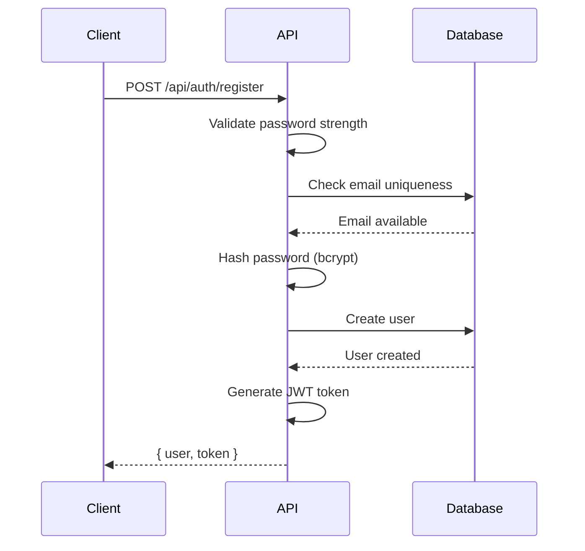

import { Tabs, TabItem, Aside } from '@astrojs/starlight/components';

The Rent-a-Wheel platform implements a robust, multi-method authentication system with hybrid RBAC + ABAC authorization.

## Authentication Methods

The platform supports three authentication methods:

| Method                 | Status         | Description                                 |
| ---------------------- | -------------- | ------------------------------------------- |
| **Email + Password**   | ✅ Implemented | Traditional credential-based authentication |
| **Passkey (WebAuthn)** | ✅ Implemented | Passwordless biometric authentication       |
| **OAuth**              | 🔨 Planned     | Google, GitHub social login                 |

## Password Authentication

### Registration Flow



### Password Requirements

The system enforces password strength validation:

- Minimum 8 characters
- At least one uppercase letter
- At least one lowercase letter
- At least one number
- At least one special character

```typescript
// Password validation
const passwordValidation = validatePasswordStrength(password);
if (!passwordValidation.valid) {
  throw new BadRequestException('Weak password', passwordValidation.errors);
}
```

### Password Hashing

Passwords are hashed using bcrypt with a cost factor of 10:

```typescript
import bcrypt from 'bcrypt';

const SALT_ROUNDS = 10;

export async function hashPassword(password: string): Promise<string> {
  return bcrypt.hash(password, SALT_ROUNDS);
}

export async function verifyPassword(
  password: string,
  hash: string,
): Promise<boolean> {
  return bcrypt.compare(password, hash);
}
```

## JWT Token System

### Token Structure

```typescript
interface JWTPayload {
  userId: string;
  email: string;
  role: UserRole;
  tenantId?: string;
  iat: number;
  exp: number;
}
```

### Token Generation

```typescript
import jwt from 'jsonwebtoken';

export function generateToken(payload: TokenPayload): string {
  return jwt.sign(payload, process.env.JWT_SECRET!, {
    expiresIn: process.env.JWT_EXPIRES_IN || '7d',
  });
}
```

### Token Verification

```typescript
export function verifyToken(token: string): JWTPayload {
  return jwt.verify(token, process.env.JWT_SECRET!) as JWTPayload;
}
```

## Passkey (WebAuthn) Authentication

<Aside type="note">
  Passkey authentication provides passwordless login using biometrics or security keys.
</Aside>

### Passkey Registration

```typescript
export async function generateRegistrationOptions(user: User) {
  const options = await generateRegistrationOptions({
    rpName: 'Rent-a-Wheel',
    rpID: process.env.RP_ID || 'localhost',
    userID: user.id,
    userName: user.email,
    attestationType: 'none',
    authenticatorSelection: {
      authenticatorAttachment: 'platform',
      userVerification: 'required',
    },
  });
  return options;
}
```

### Passkey Verification

```typescript
export async function verifyRegistration(
  response: RegistrationResponse,
  expectedChallenge: string,
) {
  const verification = await verifyRegistrationResponse({
    response,
    expectedChallenge,
    expectedOrigin: process.env.WEBAUTHN_ORIGIN || 'http://localhost:3000',
    expectedRPID: process.env.RP_ID || 'localhost',
  });
  return verification;
}
```

## Authorization: Hybrid RBAC + ABAC

### User Roles

```typescript
enum UserRole {
  SUPER_ADMIN   // Platform owner - full access
  TENANT_ADMIN  // Rental business owner - full tenant access
  TENANT_USER   // Staff member - limited access
}
```

### Role-Based Permissions (RBAC)

Each role has predefined permissions:

<Tabs>
  <TabItem label="Super Admin">
    ```typescript
    SUPER_ADMIN: [
      { resource: '*', action: '*' },  // Full access
    ]
    ```
  </TabItem>
  <TabItem label="Tenant Admin">
    ```typescript
    TENANT_ADMIN: [
      { resource: 'customer', action: '*' },
      { resource: 'vehicle', action: '*' },
      { resource: 'booking', action: '*' },
      { resource: 'form', action: '*' },
      { resource: 'website', action: '*' },
      { resource: 'subscription', action: 'read' },
      { resource: 'user', action: '*' },
    ]
    ```
  </TabItem>
  <TabItem label="Tenant User">
    ```typescript
    TENANT_USER: [
      { resource: 'customer', action: 'read' },
      { resource: 'customer', action: 'create' },
      { resource: 'customer', action: 'update' },
      { resource: 'vehicle', action: 'read' },
      { resource: 'booking', action: '*' },
      { resource: 'form', action: 'read' },
    ]
    ```
  </TabItem>
</Tabs>

### Attribute-Based Access Control (ABAC)

ABAC provides additional context-based rules:

```typescript
export function checkAttributeAccess(context: AccessContext): boolean {
  const { user, resource, action, attributes } = context;

  // Super admins bypass all ABAC rules
  if (user.role === 'SUPER_ADMIN') {
    return true;
  }

  // Tenant isolation: Users can only access their tenant's data
  const tenantAttr = attributes.find((attr) => attr.key === 'tenantId');
  if (tenantAttr && tenantAttr.value !== user.tenantId) {
    return false;
  }

  // Ownership: Users can only edit their own profile
  if (resource === 'user' && action === 'update') {
    const userIdAttr = attributes.find((attr) => attr.key === 'userId');
    if (
      userIdAttr &&
      userIdAttr.value !== user.id &&
      user.role !== 'TENANT_ADMIN'
    ) {
      return false;
    }
  }

  return true;
}
```

### Combined Access Check

```typescript
export function hasAccess(context: AccessContext): boolean {
  // First check RBAC
  const hasRbacAccess = hasRolePermission(
    context.user.role,
    context.resource,
    context.action,
  );

  if (!hasRbacAccess) {
    return false;
  }

  // Then refine with ABAC
  return checkAttributeAccess(context);
}
```

### Express Middleware

```typescript
// Usage in routes
router.post(
  '/customers',
  requireAccess('customer', 'create'),
  createCustomerController,
);
```

## Multi-Tenancy

### Tenant Isolation

All database queries are filtered by `tenantId`:

```typescript
// Repository pattern ensures tenant isolation
async findAll(pagination: PaginationDto, tenantId: string) {
  return this.prisma.customer.findMany({
    where: { tenantId },  // Always filter by tenant
    skip: pagination.skip,
    take: pagination.limit,
  });
}
```

### Subdomain-Based Routing

Each tenant has a unique subdomain:

```
johnsrentals.rentawheel.com  → tenantId: "johns-rentals"
premiumcars.rentawheel.com   → tenantId: "premium-cars"
```

## Security Best Practices

| Practice         | Implementation                    |
| ---------------- | --------------------------------- |
| Password Hashing | bcrypt with cost factor 10        |
| Token Expiry     | 7 days default (configurable)     |
| HTTPS Only       | Production cookies marked secure  |
| Rate Limiting    | 100 requests per 15 minutes       |
| CSRF Protection  | Token-based for mutating requests |
| Input Validation | Zod schemas on all endpoints      |

## Auth Package Structure

```
packages/auth/src/
├── index.ts       # Public exports
├── jwt.ts         # JWT utilities
├── password.ts    # Password hashing
├── passkey.ts     # WebAuthn utilities
├── rbac.ts        # RBAC + ABAC logic
├── types.ts       # TypeScript types
└── config.ts      # Configuration
```

## Next Steps

- [Database Schema](/technical/database) - User and Tenant models
- [API Reference](/technical/api) - Auth endpoints
- [Architecture Overview](/technical/architecture) - Full system design
